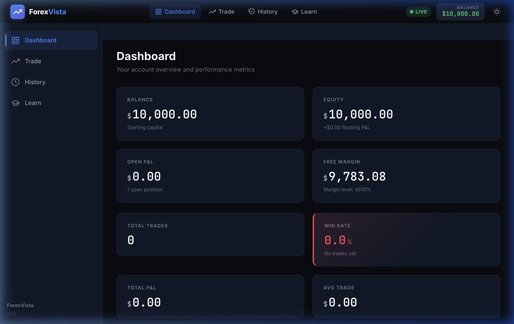
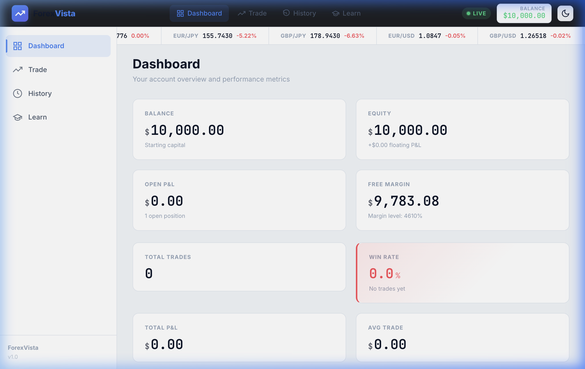
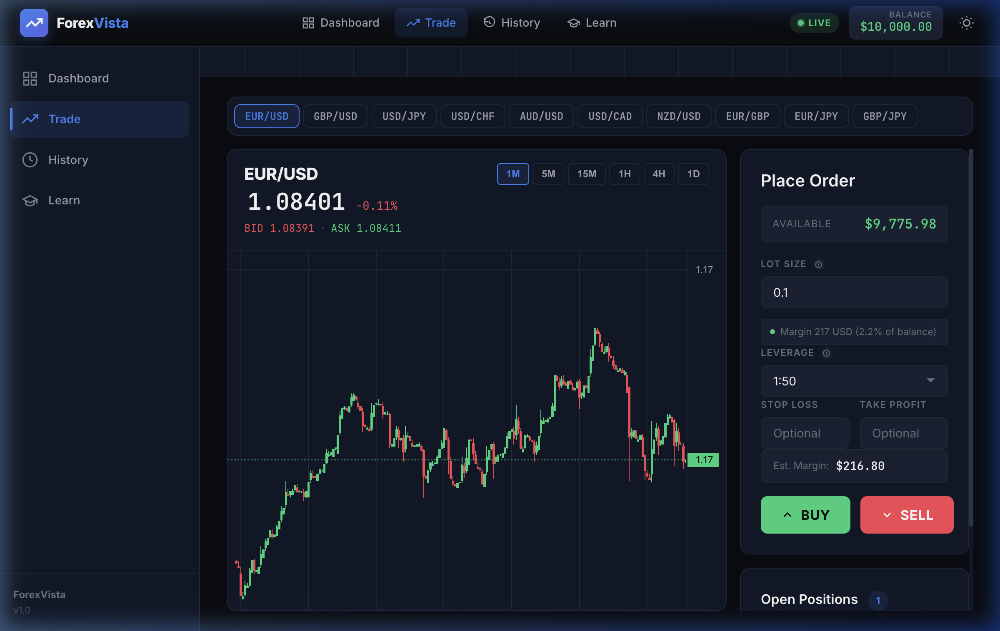

# 🌊 ForexVista - Premium Forex Trading Simulator

**ForexVista** is a high-performance, frontend-only Forex Trading Simulation and Learning Platform built with **Angular 21**. It provides a professional-grade experience for users to learn the mechanics of the forex market, practice trading with real-time data, and track their performance without financial risk.



---

## ✨ Key Features

### 📊 Professional Trading Terminal
- **Interactive Charting**: Powered by TradingView's `lightweight-charts` for seamless price visualization.
- **Real-time Market Data**: Integration with Twelve Data API (with a robust mock fallback for offline/development).
- **Advanced Order Management**: Execute Buy/Sell orders with custom Lot Sizes and Leverage.
- **Risk Indicators**: Real-time margin calculation and risk warnings (e.g., "High Risk" indicator for high margin usage).

### 📈 Comprehensive Dashboard
- **Performance Metrics**: Track Balance, Equity, Free Margin, and Margin Level.
- **Visual Statistics**: Win Rate breakdown with live P&L updates.
- **Animated Stats**: Smooth numerical transitions and state indicators.

### 🌓 Premium UX/UI
- **Dark & Light Modes**: Seamless theme switching with persistent glassmorphic effects.
- **Responsive Design**: Mobile-first architecture with a dedicated sidebar and hamburger menu.
- **Micro-Animations**: Enhanced feedback using standard Angular animations and CSS transitions.

### 🎓 Learning Hub
- **Educational Curriculum**: Progressive learning modules covering Forex basics, technical analysis, and risk management.
- **Interactive Progress**: Track your journey from a novice to a pro trader.

---

## 🚀 Tech Stack

- **Core**: Angular 21 (Standalone Components, Signals, RxJS)
- **State Management**: Service-based Signals & BehaviorSubjects
- **Charts**: Lightweight Charts v5 (TradingView)
- **Data Persistence**: LocalStorage (prefix: `fv_`)
- **Styling**: Vanilla CSS Design System with custom tokens
- **Build Tool**: Vite

---

## 🛠️ Getting Started

### Prerequisites
- Node.js (v20 or higher)
- Angular CLI (`npm install -g @angular/cli`)

### Installation
1. Clone the repository:
   ```bash
   git clone <repository-url>
   cd forex-vista
   ```
2. Install dependencies:
   ```bash
   npm install
   ```
3. Set up Environment:
   Create or update `src/environments/environment.ts` with your Twelve Data API key:
   ```typescript
   export const environment = {
     production: false,
     twelveDataApiKey: 'YOUR_API_KEY_HERE'
   };
   ```

### Running Locally
```bash
npm run dev
```
Navigate to `http://localhost:4200/`.

---

## 📖 Trading Guide

1. **Starting Capital**: You begin with a virtual balance of **$10,000.00**.
2. **Placing a Trade**:
   - Go to the **Trade** tab.
   - Select a Currency Pair (e.g., EUR/USD).
   - Adjust your **Lot Size** (e.g., 0.1 for $1.00 per pip approx).
   - Select **Leverage** (default is 1:50).
   - Click **BUY** or **SELL**.
3. **Monitoring Positions**:
   - View your open positions in the **Open Positions** panel or the **Dashboard**.
   - Monitor the **Risk Indicator**; if it turns red, your margin level is dangerously low.
4. **Closing Trades**:
   - Click the "Close" button on any open position to realize your P&L.
   - Your history will be updated in the **History** tab.
5. **Resetting**:
   - If you want to start over, go to the **History** tab and click **Reset Account**.

---

## 📂 Architecture

- `src/app/core/services`: Simulation engine, data fetching, and theme logic.
- `src/app/features`: Main page components (Dashboard, Trading, History, Learn).
- `src/app/shared`: Reusable UI components (StatCards, PriceTicker, Navbar).
- `src/styles.css`: Central design system and theme variables.

---

## 🔗 Screenshots

| Light Mode Dashboard | Trading Panel |
| :---: | :---: |
|  |  |

---

*Built with ❤️ by Emeka.*
